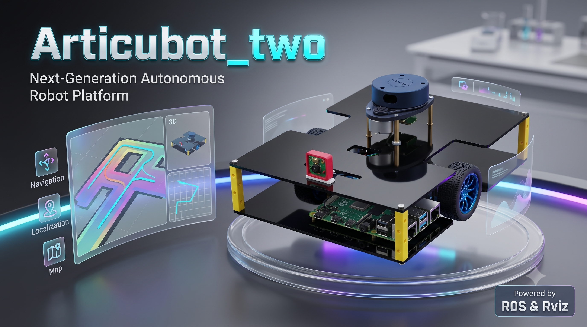
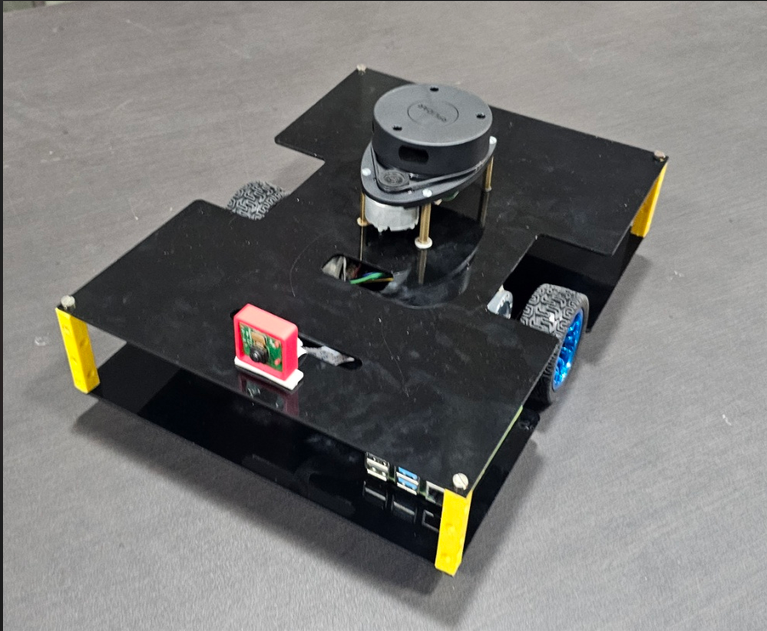
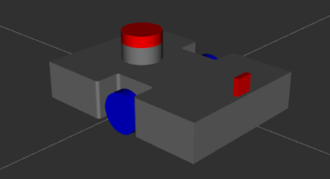
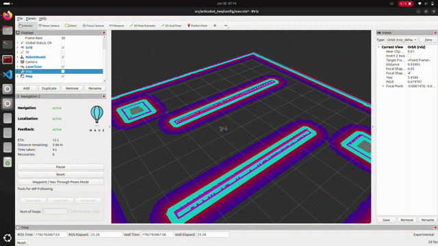

<div align="center">



# Beam Articubot Two V2

### Differential Drive Mobile Robot built with ROS 2 Jazzy

<p>
  <a href="https://docs.ros.org/en/jazzy/">
    
  </a>
  
  
  <a href="https://github.com/attu0/articubot_two/stargazers">
    
  </a>
  <a href="https://github.com/attu0/articubot_two/issues">
    
  </a>
  <a href="https://github.com/attu0/articubot_two/commits/main">
    
  </a>
</p>

</div>

---

# Overview

**Beam Articubot Two V2** is a differential drive mobile robot developed using **ROS 2 Jazzy**. It provides a complete platform for learning and experimenting with robot modeling, simulation, mapping, localization, and autonomous navigation.

The repository includes support for:

* Gazebo simulation
* RViz visualization
* SLAM Toolbox
* AMCL localization
* Nav2 navigation
* `ros2_control`
* RPLIDAR integration

---

# Features

* Differential drive mobile robot
* URDF/Xacro robot description
* Gazebo simulation
* RViz visualization
* SLAM Toolbox mapping
* AMCL localization
* Nav2 navigation
* `ros2_control` integration
* RPLIDAR support

---

# Repository Structure

```text
articubot_two/
├── config/         # Nav2, SLAM, AMCL, RViz, and controller configuration
├── description/    # URDF and Xacro files
├── launch/         # Launch files
├── map/            # Saved maps
├── media/          # Images, screenshots, and GIFs
├── meshes/         # STL meshes
├── scripts/        # Helper scripts
└── worlds/         # Gazebo worlds
```

---

# Hardware

<div align="center">



</div>

The robot uses a simple differential drive configuration consisting of:

* Two drive wheels
* Front caster wheel
* Rear caster wheel
* 2D LiDAR
* IMU
* Differential drive controller

---

# Simulation

<div align="center">



</div>

The robot can be simulated in Gazebo and visualized in RViz.

### Navigation



The navigation stack consists of:

* SLAM Toolbox
* AMCL
* Nav2
* Global and Local Costmaps
* Global and Local Planners

---

# Software Stack

| Component         | Technology            |
| ----------------- | --------------------- |
| Operating System  | Ubuntu 24.04          |
| ROS Distribution  | ROS 2 Jazzy           |
| Simulation        | Gazebo Jetty          |
| Visualization     | RViz2                 |
| Mapping           | SLAM Toolbox          |
| Localization      | AMCL                  |
| Navigation        | Nav2                  |
| Robot Description | URDF + Xacro          |
| Control           | ros2_control          |
| Drive Controller  | diff_drive_controller |

---

# Getting Started

## Prerequisites

* Ubuntu 24.04
* ROS 2 Jazzy
* Gazebo Jetty
* Nav2 Jazzy

### Build

```bash
mkdir -p ros2_ws/src && cd ~/ros2_ws/src
git clone https://github.com/attu/articubot_two
cd ~/ros2_ws
rosdep install --from-paths src --ignore-src -r -y
colcon build --symlink-install
source install/setup.bash
```

---

# Documentation

Separate guides are provided for simulation and the physical robot.

| Guide                  | Description                                           |
| ---------------------- | ----------------------------------------------------- |
| **[`Simulation.md`](readme_for_dev.md)** | Gazebo simulation, SLAM, localization, and Nav2 setup |
| **[`Robot.md`](readme_for_bot.md)** | Running the project on the physical robot             |

---

# Author

**Atharv Mahesh Mudse**

---

# License

This project is licensed under the **MIT License**.
